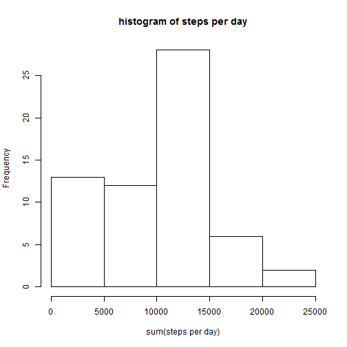
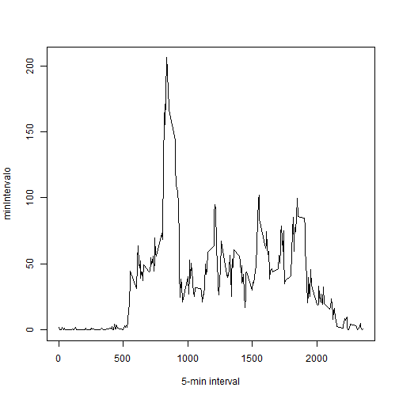
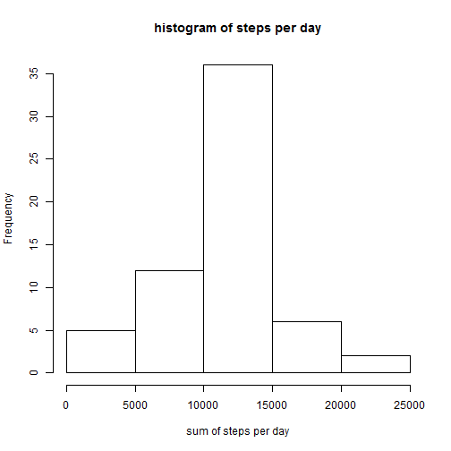
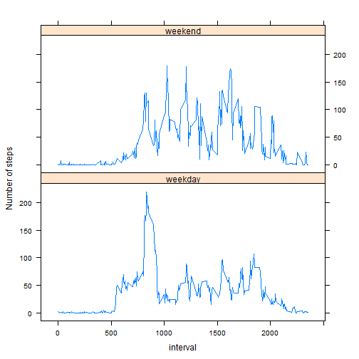

#Peer Assessment 1: Activity Monitoring Devices 
## 1 Introduction
It is now possible to collect a large amount of data about personal movement using activity monitoring devices such as a Fitbit, Nike Fuelband, or Jawbone Up. These type of devices are part of the "quantified self" movement -- a group of enthusiasts who take measurements about themselves regularly to improve their health, to find patterns in their behavior, or because they are tech geeks. But these data remain under-utilized both because the raw data are hard to obtain and there is a lack of statistical methods and software for processing and interpreting the data.

This assignment makes use of data from a personal activity monitoring device. This device collects data at 5 minute intervals through out the day. The data consists of two months of data from an anonymous individual collected during the months of October and November, 2012 and include the number of steps taken in 5 minute intervals each day.

###1.1 Data

The data for this assignment can be downloaded from the course web site:

 - **Dataset:** Activity monitoring data [52K]
The variables included in this dataset are:

- **steps:** Number of steps taking in a 5-minute interval (missing values are coded as NA)

- **date:** The date on which the measurement was taken in YYYY-MM-DD format

- **interval:** Identifier for the 5-minute interval in which measurement was taken

The dataset is stored in a comma-sepa  
  
###1.2 Read the data
firts we red the data in to r. Meke sure that the file is in de work directory.

```r
  ##setwd("~/")
  data <- read.csv("activity.csv", header = T, sep = ",")
```

this is a summary of the data: 

```r
  summary(data)
```

```
##      steps                date          interval     
##  Min.   :  0.00   2012-10-01:  288   Min.   :   0.0  
##  1st Qu.:  0.00   2012-10-02:  288   1st Qu.: 588.8  
##  Median :  0.00   2012-10-03:  288   Median :1177.5  
##  Mean   : 37.38   2012-10-04:  288   Mean   :1177.5  
##  3rd Qu.: 12.00   2012-10-05:  288   3rd Qu.:1766.2  
##  Max.   :806.00   2012-10-06:  288   Max.   :2355.0  
##  NA's   :2304     (Other)   :15840
```
##2. What is mean total number of steps taken per day?
create a vector call "suma" for the histogram

```r
  suma <- tapply(data$steps, data$date, sum, na.rm=T)
```
Histogram:  

```r
  echo = TRUE
  hist(suma, xlab = "sum(steps per day)", main = "histogram of steps per day")
```

 

The mean for the data set is:

```r
    round(mean(suma))
```

```
## [1] 9354
```
the median f the data set is:

```r
    round(median(suma))
```

```
## [1] 10395
```
##3. what is the average daily activity pattern?
this is the time series plot of the 5 min interval and the nomber of step taken.

```r
    minIntervalo <- tapply(data$steps, data$interval, mean, na.rm=T)
    plot(minIntervalo ~ unique(data$interval), type="l", xlab = "5-min interval")
```

 

the interval that contains the maximun number of step is:

```r
  minIntervalo[which.max(minIntervalo)]
```

```
##      835 
## 206.1698
```
##4. Imputing missing values

the total of missing values is:

```r
  na <- which(is.na(data$steps))
  length(na)
```

```
## [1] 2304
```
we change the na values in to the mean

```r
  datalimp <- data  # creation of the dataset that will have no more NAs
  for (i in 1:nrow(data)){
      if(is.na(data$steps[i])){
          datalimp$steps[i]<- minIntervalo[[as.character(data[i, "interval"])]]
      }
  }
  summary(datalimp)
```

```
##      steps                date          interval     
##  Min.   :  0.00   2012-10-01:  288   Min.   :   0.0  
##  1st Qu.:  0.00   2012-10-02:  288   1st Qu.: 588.8  
##  Median :  0.00   2012-10-03:  288   Median :1177.5  
##  Mean   : 37.38   2012-10-04:  288   Mean   :1177.5  
##  3rd Qu.: 27.00   2012-10-05:  288   3rd Qu.:1766.2  
##  Max.   :806.00   2012-10-06:  288   Max.   :2355.0  
##                   (Other)   :15840
```
**The mean is the same, but the nedian is closer to the mean.**

this is the histogram for the corresponding data:

```r
  suma2 <- tapply(datalimp$steps, datalimp$date, sum, na.rm=T)
  hist(suma2, xlab = "sum of steps per day", main = "histogram of steps per day")
```

 

##5. Are there differences in activity patterns between weekdays and weekends?
Create a new factor variable in the dataset with two levels – “weekday” and “weekend” indicating whether a given date is a weekday or weekend day.

```r
  datalimp$weekday <- c("weekday")
  datalimp[weekdays(as.Date(datalimp[, 2])) %in% c("Saturday", "Sunday", "sábado", "domingo"), ][4] <- c("weekend")
datalimp$weekday <- factor(datalimp$weekday)
table(datalimp$weekday == "weekend")
```

```
## 
## FALSE  TRUE 
## 15264  2304
```
Now we separate the data in order to compare

```r
datalimp_weekend <- subset(datalimp, datalimp$weekday == "weekend")
datalimp_weekday <- subset(datalimp, datalimp$weekday == "weekday")

mean_datalimp_weekday <- tapply(datalimp_weekday$steps, datalimp_weekday$interval, mean)
mean_datalimp_weekend <- tapply(datalimp_weekend$steps, datalimp_weekend$interval, mean)
```
then, we createa a plot for each data set. *It can be observed that there is a small difference between the period.*

```r
  df_weekday <- NULL
  df_weekend <- NULL
  df_final <- NULL
  df_weekday <- data.frame(interval = unique(datalimp_weekday$interval), avg = as.numeric(mean_datalimp_weekday),   day = rep("weekday", length(mean_datalimp_weekday)))
  df_weekend <- data.frame(interval = unique(datalimp_weekend$interval), avg = as.numeric(mean_datalimp_weekend), day = rep("weekend", length(mean_datalimp_weekend)))
  df_final <- rbind(df_weekday, df_weekend)
library(lattice)
  xyplot(avg ~ interval | day, data = df_final, layout = c(1, 2), 
       type = "l", ylab = "Number of steps")
```

 
